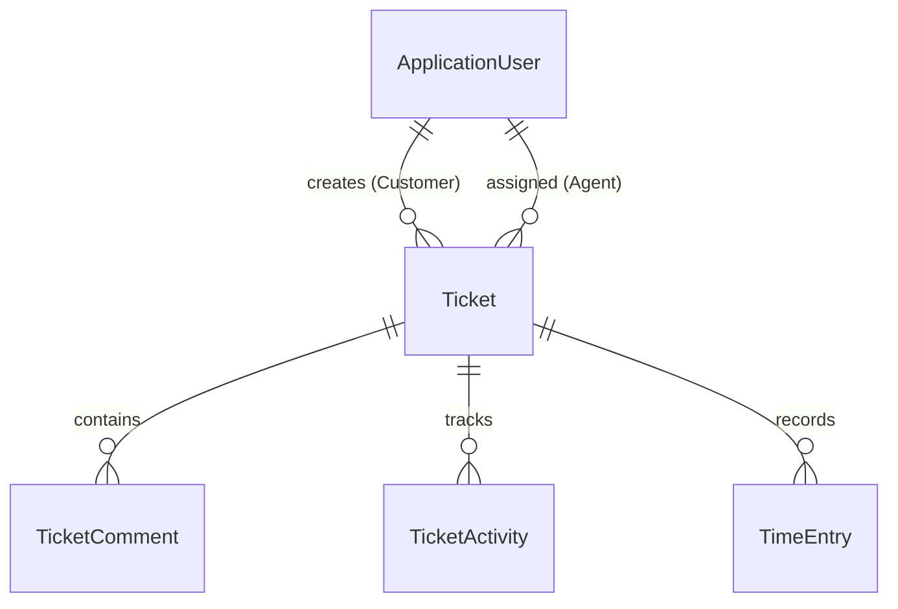

# Support Ticket Management System - Backend

A robust, enterprise-grade ASP.NET Core 8 Web API serving as the backend for the Support Ticket Management System. This project enforces strict role-based access control, customer data isolation, and comprehensive ticket lifecycle management using Clean Architecture principles.

## Live Resources

- **Live API Base URL**: [https://support-ticket.runasp.net/api/v1](https://support-ticket.runasp.net/api/v1)
- **Swagger / OpenAPI Documentation**: [Swagger Interface](https://support-ticket.runasp.net/swagger/index.html)
- **Frontend Live Demo**: [https://ticket--hub.web.app](https://ticket--hub.web.app)
- **Frontend GitHub Repository**: [Frontend Repository](https://github.com/Ibrahim-Hassan74/TicketHub)
- **Backend GitHub Repository**: [Backend Repository](https://github.com/Ibrahim-Hassan74/SupportTicketManagement)

## Assessment Overview

This backend was implemented as part of the Support Ticket Management technical assessment. The objective was to build a system allowing an organization to manage customer support tickets with strict role-based constraints, robust state transition rules, and comprehensive time-tracking and activity logging. 

## Key Features

### Authentication & Authorization
- **JWT Authentication**: Secure token-based access.
- **Role-Based Authorization**: Distinct access levels for `Admin`, `SupportAgent`, and `Customer`.
- **Customer Data Isolation**: Customers can only query, view, and interact with tickets they created.

### Ticket Management
- **Lifecycle Management**: Strict enforcement of state transitions (e.g., Open -> In Progress -> Resolved -> Closed).
- **Advanced Querying**: Full support for pagination, searching, sorting, and filtering (by status, priority, role).
- **Assignments**: Administrators can assign tickets to specific support agents.

### Comments & Activities
- **Discussion Threads**: Users can comment on tickets based on their access level.
- **Activity Timeline**: Automated system logging for state transitions, priority changes, and agent assignments.

### Time Tracking
- **Work Logs**: Support agents can log time entries against assigned tickets (work date, duration, description).
- **Automatic Aggregation**: The system calculates the total time spent per ticket.

### Dashboard & Reporting
- **Metrics**: Endpoints to aggregate total tickets, open critical tickets, average resolution time, and agent workloads.

## Architecture

The solution adheres to Clean Architecture, cleanly separating domain logic from external concerns and infrastructure.

```text
SupportTicketManagement
|
|-- src
|   |-- SupportTicketManagement.API
|   |   |-- Configurations
|   |   |-- Controllers
|   |   |-- Middleware
|   |   `-- StartupExtensions
|   |
|   |-- SupportTicketManagement.Core
|   |   |-- Domain
|   |   |   |-- Entities
|   |   |   `-- IdentityEntities
|   |   |-- DTO
|   |   |-- Enums
|   |   |-- ServiceContracts
|   |   `-- Services
|   |
|   `-- SupportTicketManagement.Infrastructure
|       |-- Data
|       |   `-- Migrations
|       |-- Identity
|       `-- Repository
|
`-- Tests
    |-- SupportTicketManagement.ControllerTests
    `-- SupportTicketManagement.ServiceTests
```

- **Core**: Contains the enterprise domain entities, DTOs, Enums, and business logic (Services/ServiceContracts). It has no dependencies on external frameworks or databases.
- **Infrastructure**: Implements the repository interfaces, EF Core `DbContext`, Identity setup, and database migrations.
- **API**: The presentation layer containing Controllers, JWT configuration, exception handling middleware, and dependency injection composition.
- **Tests**: Contains xUnit projects (`ControllerTests` and `ServiceTests`) to ensure business logic and API endpoints function correctly in isolation.

## Domain Model

The core entities are designed around the ticket lifecycle and user interactions.



## Ticket Lifecycle

The system enforces valid transitions for ticket statuses to ensure data integrity:

```text
Open
  |
  v
In Progress
  |
  v
Resolved
  |
  v
Closed
```

Invalid transitions (e.g., jumping from Open directly to Closed without being resolved) are actively blocked by the business logic layer.

## Database

The application utilizes **SQL Server** with **Entity Framework Core (Code First)**.

To apply the latest migrations to your local database, run:
```bash
dotnet ef database update --project SupportTicketManagement.Infrastructure --startup-project SupportTicketManagement.API
```

## Seed Data

The database automatically seeds development accounts and roles if they do not exist. These accounts are for development and testing purposes only.

The development password for all seeded accounts is: `Aa1234567`

| Role          | Email                       | Password  |
| ------------- | --------------------------- | --------- |
| Admin         | admin1@example.com          | Aa1234567 |
| Support Agent | agent1@example.com          | Aa1234567 |
| Customer      | customer1@example.com       | Aa1234567 |

## API Documentation

The RESTful API endpoints are grouped logically:

```text
Account
|-- POST /api/v1/Account/register
|-- POST /api/v1/Account/login
|-- GET  /api/v1/Account/current-user

Dashboard
|-- GET /api/v1/Dashboard/statistics

Tickets
|-- GET    /api/v1/Tickets
|-- POST   /api/v1/Tickets
|-- GET    /api/v1/Tickets/{id}
|-- PUT    /api/v1/Tickets/{id}/status
|-- PUT    /api/v1/Tickets/{id}/priority
|-- PUT    /api/v1/Tickets/{id}/assign

TicketComments
|-- GET    /api/v1/Tickets/{ticketId}/comments
|-- POST   /api/v1/Tickets/{ticketId}/comments

TicketActivities
|-- GET    /api/v1/Tickets/{ticketId}/activities

TicketTimeEntries
|-- GET    /api/v1/Tickets/{ticketId}/time-entries
|-- POST   /api/v1/Tickets/{ticketId}/time-entries
|-- DELETE /api/v1/Tickets/{ticketId}/time-entries/{entryId}

Users
|-- GET    /api/v1/Users
|-- POST   /api/v1/Users
|-- PUT    /api/v1/Users/{id}
|-- GET    /api/v1/Users/agents
```

## Configuration

Required environment configuration is located in `appsettings.json`. For local development, update your `appsettings.Development.json`.

### CORS & JWT Security
To ensure strict security, CORS and JWT validation are explicitly configured:
- **CORS**: Controlled by the `AllowedOrigins` array. Only the specific frontend URLs defined here are permitted to interact with the API, tightening browser security.
- **JWT Validation**: The API validates that incoming tokens were issued by the correct authority (`Issuer`) and intended for authorized clients (`Audiences` like the frontend app or Postman).

```json
{
  "AllowedOrigins": [
    "https://ticket--hub.web.app",
    "http://localhost:4200"
  ],
  "ConnectionStrings": {
    "DefaultConnection": "<YOUR_CONNECTION_STRING>"
  },
  "Jwt": {
    "Issuer": "https://support-ticket.api",
    "Audiences": [ 
      "https://localhost:4200",
      "postman-client"
    ],
    "EXPIRATION_MINUTES": 30,
    "Key": "<YOUR_SECRET_KEY_MINIMUM_32_CHARS>"
  }
}
```

## Running Locally

1. Clone the repository.
2. Navigate to the API project folder: `cd SupportTicketManagement.API`
3. Update `appsettings.Development.json` with your SQL Server connection string.
4. Apply the database migrations:
   ```bash
   dotnet ef database update --project ../SupportTicketManagement.Infrastructure
   ```
5. Run the API:
   ```bash
   dotnet run
   ```
6. Open Swagger at `https://localhost:7235/swagger/index.html` (or the port specified in your launchSettings).
7. Login using one of the seeded accounts to receive a JWT.

## Running with Docker

The project includes a production-ready `.NET 10` `Dockerfile` and a `docker-compose.yml` for orchestrating the API and SQL Server together in isolated containers.

1. Ensure Docker Desktop is running.
2. Create a `.env` file in the root directory (you can use the existing `.env` template) to securely provide your `SA_PASSWORD` and `JWT_KEY`.
3. Start the services:
   ```bash
   docker-compose up -d --build
   ```
4. The API will wait for SQL Server to become healthy, apply migrations automatically (if configured), and be accessible on `http://localhost:5000` (or the port mapped in your `.env`).

## Testing

The solution includes xUnit test projects to ensure business rules and API endpoints function correctly in isolation.

To run the automated tests locally:

1. Navigate to the root of the backend repository.
2. Run the tests using the .NET CLI:
   ```bash
   dotnet test
   ```

## Assumptions & Limitations
- **Refresh Tokens**: While the configuration keys for refresh tokens exist in `appsettings.json`, full refresh token rotation is not actively enforced in the current endpoint structure.

## Technical Review Highlights

- **Clean Architecture**: The project strictly prohibits the `API` layer from referencing the `Infrastructure` layer directly, ensuring all database operations and external dependencies are accessed via interfaces defined in the `Core` layer.
- **Customer Data Isolation**: In `TicketsController` and `TicketService`, the user's claims are extracted via `IHttpContextAccessor`. If the user is a `Customer`, the repository queries are automatically appended with `.Where(t => t.CustomerId == userId)`, guaranteeing strict horizontal data isolation.
- **Activity Generation**: Rather than trusting clients to post activity logs, the business logic layer intercepts state mutations (like status changes or assignments) and automatically generates the corresponding `TicketActivity` entities to maintain an immutable audit trail.
- **Centralized Exception Handling**: Global exception handling middleware is utilized to catch domain exceptions and translate them into standardized RFC 7807 Problem Details responses, preventing stack traces from leaking to the client.
- **Structured Logging**: Integrated Serilog for robust, structured logging. The application captures HTTP requests, handled and unhandled exceptions, and critical business logic events across all layers, outputting them to the console and daily rolling log files.

## Assessment Requirements Coverage

| Assessment Requirement   | Implementation | Status |
| ------------------------ | -------------- | ------ |
| JWT Authentication       | Implemented securely with Identity. | [Yes] |
| Role-Based Authorization | Strict attributes applied across controllers. | [Yes] |
| Customer Data Isolation  | Enforced at the repository/service layer. | [Yes] |
| Ticket Management        | Full CRUD and lifecycle management. | [Yes] |
| Pagination               | Implemented via generic PaginatedResponse. | [Yes] |
| Filtering & Searching    | Comprehensive IQueryable extensions used. | [Yes] |
| Sorting                  | Configurable sorting included. | [Yes] |
| Activity Timeline        | Automated audit trail generation. | [Yes] |
| Time Tracking            | Included with auto-aggregation. | [Yes] |
| Dashboard Metrics        | Dedicated controller for statistics. | [Yes] |
| Automated Testing        | xUnit tests for controllers and logic. | [Yes] |
| Seed Data                | EF Core initializers included. | [Yes] |
| Dockerization            | Included Dockerfile and docker-compose.yml. | [Yes] |
| Structured Logging       | Implemented via Serilog with rolling files. | [Yes] |
